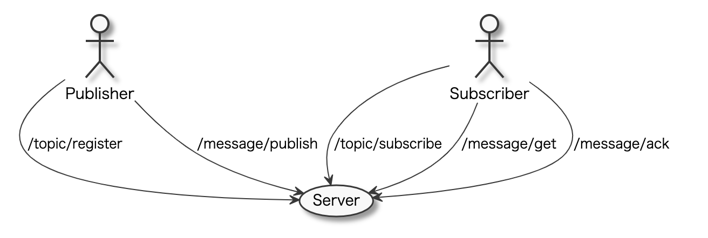

# Background
Your team has received an emergency task to develop a “Pub/Sub”-like service. 

### Use case graph:

### Use case diagram:

Publisher and Subscriber are other microservice servers inside the company.

This emergency task is divided into 2 phases:
- **Phase 1**: you must release the server to production within one week.
- **Phase 2**: another team will continue to improve the server based on the code you implemented in Phase 1. Please be aware that the team prefers modern technologies to stale ones.

Your task is to provide a production-ready server that fulfills the phase 1 requirements, and that can easily be extended by the team working on phase 2. It is estimated that the work should take approximately 8 hours to complete.

# Requirements

## Phase 1 requirements

1. Use Java for the implementation. OpenJDK must be used.
1. Any library or framework may be used, but it is expected to provide a full implementation (without using existing messaging solutions such as Kafka, RabbitMQ, …)
1. Any protocol may be used for the API.
1. The maximum size per message is 128KB.
1. Messages must be received in order by the subscribers.
1. Estimated system workload: 200 rps, 99% latency within one second.
1. Since Phase1 is an emergency solution, it is acceptable to lose messages if the server experiences unexpected downtime.
1. Please keep in mind that this repository is the only source of information for other teams, including the teams developing Publishers and Subscribers, the SRE team and the team that will work on this project in Phase2. Sufficient documentation should be provided with the project.

The requirements for phase 2 are also provided for information:

## Phase 2 requirements

1. Estimated system workload: 20000 rps, 99% latency within one second. The business may also grow much faster than estimated.
1. Messages and other data should NOT be lost except in case of a hardware-level incident.

