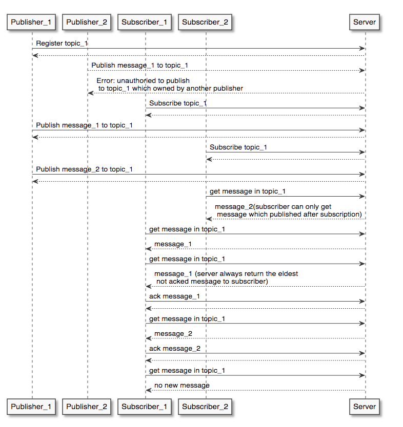

# 背景
あなたのチームは、”Pub/Sub” 同様のミドルウェアサービスサーバーを開発する緊急タスクを受けました。

### Use case graph:

### Use case diagram:

PublisherとSubscriberは会社内の他のmicroserviceです。

緊急タスクは二つのフェーズに分かれています。
- **Phase 1**: 一週間後に本番にリリースしなければいけません。
- **Phase 2**: 他のチームはあなたの実装プランをベースにしてPhase2の開発を展開していきます。引き継ぎチームではモダンな技術スタックを好みます。

あなたのタスクはphase 1の要件を満たすproduction-readyなサーバを提供することです。また、このサーバは引継ぎチームがphase 2で簡単に拡張できることが期待されています。このタスクを完了する所用時間は約8時間だと想定されています。

# 課題

## Phase 1 requirements

1. Javaで実装してください。OpenJDKを使用してください
1. どのライブラリやフレームワークを使用しても構いません。ただ、KafkaやRabbitMQのような既存のpub/subライブラリーを使わず、フルスクラッチで開発されたプロジェクトを提供することが期待されています
1. APIのインターフェース・プロトコルは自由に設計して良い
1. 1つのメッセージの最大サイズは128KBとします
1. Subscriberは送信された順にメッセージを取得します
1. 想定システムワークロード: 200 rps, 99%のトラフィックが1秒以内に応答を返すこと
1. Phase1はあくまで緊急対策なので、想定外の要素でサーバーダウンした場合メッセージがロストしても構いません
1. このRepositoryはPublisherとSubscriberの開発チームとSREチームとPhase2の担当チームの唯一の情報源になっていることに留意してください。十分なドキュメンテーションを提供することが期待されています

参考までに、Phase 2 の要件はこちらです：

## Phase 2 requirements

1. 想定システムワークロード: 20000 rps, 99%のトラフィックが1秒以内に応答を返すこと。 ただ、ビジネスのグロース見通しが良く、想定よりワークロードが厳しくなる可能性も考慮に入れるとなお良いでしょう
1. ハードウェアのインシデントが発生しない限りはメッセージと他のデータをロストしてはいけません

